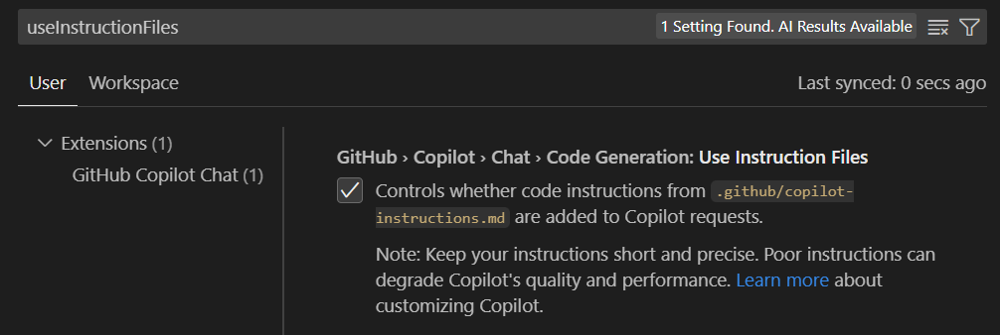
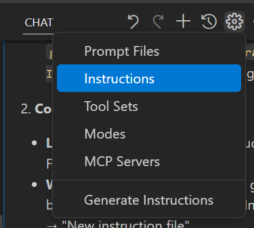
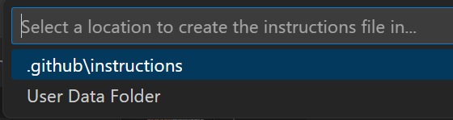
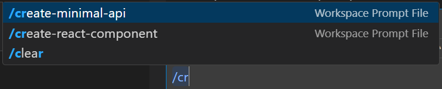
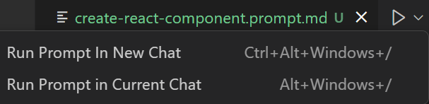
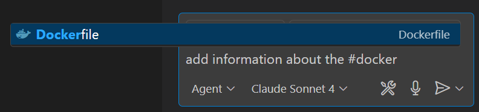
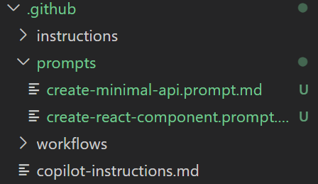

# Master Copilot Customization with Instructions and Prompt Files

Take your GitHub Copilot experience to the next level by leveraging Visual Studio Code's powerful customization features: instructions files and prompt files. These tools allow you to create consistent, project-specific AI responses that understand your coding standards, preferences, and common workflows.

> **Reference**: This guide is based on the official [Visual Studio Code Copilot Customization Documentation](https://code.visualstudio.com/docs/copilot/copilot-customization). For the most up-to-date technical details and API changes, refer to the official documentation.

## Understanding the Customization Ecosystem

Visual Studio Code offers three main ways to customize Copilot responses:

1. **`.github/copilot-instructions.md`** - Global project instructions
2. **`.instructions.md` files** - Granular, context-specific instructions
3. **`.prompt.md` files** - Reusable prompt templates for common tasks

## Setting Up Instructions Files

### Global Project Instructions

Create a `.github/copilot-instructions.md` file at your project root for project-wide guidelines:

```markdown
---
# Example: .github/copilot-instructions.md
---

# Project Coding Standards

## General Guidelines
- Use TypeScript for all new JavaScript code
- Follow functional programming patterns when possible
- Prefer composition over inheritance
- Write comprehensive JSDoc comments for all public APIs

## Testing Requirements
- Include unit tests for all business logic
- Use Jest for testing framework
- Aim for 80%+ code coverage
- Write integration tests for API endpoints

## Error Handling
- Always use proper error boundaries in React components
- Log errors with structured logging
- Return meaningful error messages to users
- Handle async operations with proper try-catch blocks
```

**Enable Global Instructions:**
1. Open Visual Studio Code settings (Ctrl+Shift+P → "Preferences: Open Settings")
2. Search for `github.copilot.chat.codeGeneration.useInstructionFiles`
3. Set to `true`



### Granular Instructions Files

Create targeted `.instructions.md` files for specific scenarios:

#### Understanding Instructions File Naming and Frontmatter

Instructions files must follow the naming convention: `[name].instructions.md`

**File Naming Examples:**
- `react.instructions.md` - React component guidelines
- `database.instructions.md` - Database development patterns
- `testing.instructions.md` - Testing best practices
- `api-endpoints.instructions.md` - API development standards
- `typescript.instructions.md` - TypeScript coding conventions
- `security.instructions.md` - Security review guidelines

**File Location Options:**
- **Workspace**: `.github/instructions/` folder (default)
- **User Profile**: `%APPDATA%\Code\User\instructions\` (Windows)
- **Custom Locations**: Configure via `chat.instructionsFilesLocations` setting

The frontmatter section at the top of `.instructions.md` files uses YAML syntax and supports several key properties:

```yaml
---
applyTo: "glob-pattern"           # Required: Specifies which files to apply instructions to
description: "Brief description"  # Optional: Describes what the instructions do
---
```

**Key Frontmatter Properties:**

- **`applyTo`**: Controls when instructions are automatically applied
  - `"**"` - Apply to all files in the workspace
  - `"**/*.ts"` - Apply only to TypeScript files
  - `"**/*.{tsx,jsx}"` - Apply to React component files
  - `"**/tests/**/*.ts"` - Apply only to test files
  - `"src/components/**/*"` - Apply to files in specific directories

- **`description`**: Brief explanation shown when hovering over the instruction file in chat view

**Complete File Examples with Suggested Names:**

**File: `react.instructions.md`**
```yaml
---
applyTo: "**/*.{tsx,jsx}"
description: "React component development guidelines"
---
```

**File: `database.instructions.md`**
```yaml
---
applyTo: "**/models/**/*.ts"
description: "Entity Framework patterns and database guidelines"
---
```

**File: `testing.instructions.md`**
```yaml
---
applyTo: "**/tests/**/*.{ts,js}"
description: "Testing best practices and patterns"
---
```

**File: `api-endpoints.instructions.md`**
```yaml
---
applyTo: "src/api/**/*.ts"
description: "RESTful API endpoint development guidelines"
---
```

#### Framework-Specific Instructions

**Example File: `react.instructions.md`**
```markdown
---
applyTo: "**/*.{tsx,jsx}"
description: "React component development guidelines"
---

# React Component Instructions

## Component Structure
- Use functional components with hooks
- Implement proper prop validation with TypeScript interfaces
- Extract custom hooks for reusable logic
- Use React.memo for performance optimization when needed

## State Management
- Use useState for local component state
- Use useReducer for complex state logic
- Implement custom hooks for shared state logic
- Avoid prop drilling - use Context API when appropriate

## Styling
- Use CSS Modules or styled-components
- Follow BEM methodology for class naming
- Implement responsive design with mobile-first approach
- Use CSS custom properties for theming
```

#### Database-Specific Instructions

**Example File: `database.instructions.md`**
```markdown
---
applyTo: "**/models/**/*.ts"
description: "Database model and query guidelines"
---

# Database Development Guidelines

## Entity Framework Patterns
- Use repository pattern for data access
- Implement proper entity relationships
- Include audit fields (CreatedAt, UpdatedAt, CreatedBy)
- Use value objects for complex properties

## Query Optimization
- Always use parameterized queries
- Implement proper indexing strategies
- Use async methods for all database operations
- Include proper error handling for database exceptions
```

### Creating Instructions Files via Visual Studio Code



**Quick Creation Method:**
1. Open Chat view in Visual Studio Code
2. Click the "Configure Chat" button (gear icon)
3. Select "Instructions" → "New instruction file"
4. Choose workspace or user profile location
5. Name your file and start writing instructions



**Command Palette Method:**
- Press `Ctrl+Shift+P`
- Type "Chat: New Instructions File"
- Follow the prompts

## Mastering Prompt Files

Prompt files (`.prompt.md`) are reusable templates for common development tasks.

### Understanding Prompt File Naming and Frontmatter

Prompt files must follow the naming convention: `[name].prompt.md`

**File Naming Examples:**
- `create-react-component.prompt.md` - Generate React components
- `security-review.prompt.md` - Perform security code reviews
- `api-endpoint.prompt.md` - Create RESTful API endpoints
- `generate-tests.prompt.md` - Create unit and integration tests
- `refactor-code.prompt.md` - Code refactoring workflows
- `generate-docs.prompt.md` - Documentation generation

**File Location Options:**
- **Workspace**: `.github/prompts/` folder (default)
- **User Profile**: `%APPDATA%\Code\User\prompts\` (Windows)
- **Custom Locations**: Configure via `chat.promptFilesLocations` setting

Prompt files use YAML frontmatter to configure how the prompt should be executed:

```yaml
---
mode: "ask"|"edit"|"agent"        # Optional: Chat mode to use (default: "agent")
model: "gpt-4"|"gpt-3.5-turbo"    # Optional: Specific AI model to use
tools: ["tool1", "tool2"]         # Optional: Tools available in agent mode
description: "Brief description"   # Optional: What the prompt does
---
```

**Frontmatter Properties Explained:**

- **`mode`**: Determines how the prompt operates
  - `"ask"` - Simple question/answer mode
  - `"edit"` - Direct file editing mode
  - `"agent"` - Full agent mode with tool access (default)

- **`model`**: Specifies which AI model to use
  - `"gpt-4"` - Most capable model for complex tasks
  - `"gpt-3.5-turbo"` - Faster, more cost-effective for simpler tasks
  - If not specified, uses the currently selected model in Visual Studio Code

- **`tools`**: Array of tool names/sets available in agent mode
  - `["typescript"]` - TypeScript-specific tools
  - `["react", "typescript"]` - Multiple tool sets
  - `["web-search", "file-system"]` - External tools
  - Configure available tools via "Configure Tools" in chat

- **`description`**: Brief explanation of the prompt's purpose (shown in UI)

**Common Frontmatter Patterns:**

```yaml
# For code generation tasks
---
mode: "agent"
model: "gpt-4"
tools: ["typescript", "react"]
description: "Generate React component with tests"
---

# For code review tasks
---
mode: "ask"
description: "Perform security code review"
---

# For file editing tasks
---
mode: "edit"
model: "gpt-4"
description: "Refactor code following team standards"
---

# For documentation tasks
---
mode: "agent"
tools: ["markdown", "web-search"]
description: "Generate comprehensive API documentation"
---
```

### Basic Prompt File Structure

**Example File: `create-react-component.prompt.md`**
```markdown
---
mode: "agent"
model: "gpt-4"
tools: ["typescript", "react"]
description: "Generate a React component with TypeScript"
---

# Create React Component

Create a new React component with the following requirements:

## Component Specifications
- Component name: ${input:componentName:Enter component name}
- Use TypeScript with proper interfaces
- Include proper prop validation
- Implement responsive design
- Add comprehensive JSDoc comments

## Additional Context
- Follow our project's coding standards: [coding-standards](.github/copilot-instructions.md)
- Reference existing components: #src/components/
- Use our design system: #src/styles/design-system.ts

## Output Requirements
- Generate the component file
- Create a corresponding test file
- Include usage examples in comments
- Export the component properly

Selected files for context: ${selection}
```

### Advanced Prompt Examples

#### Security Review Prompt

**Example File: `security-review.prompt.md`**
```markdown
---
mode: "agent"
description: "Perform comprehensive security review"
---

# Security Code Review

Perform a thorough security analysis of the selected code:

## Review Areas
1. **Input Validation**: Check for proper sanitization and validation
2. **Authentication**: Verify proper auth implementation
3. **Authorization**: Ensure proper access controls
4. **Data Exposure**: Look for sensitive data leaks
5. **SQL Injection**: Check for parameterized queries
6. **XSS Prevention**: Verify proper output encoding

## Context Files
- Security guidelines: [security-guidelines](./docs/security.md)
- Authentication service: #src/services/auth.ts

## Output Format
Provide findings in this format:
- **Issue**: Description of the security concern
- **Severity**: Critical/High/Medium/Low
- **Location**: File and line number
- **Recommendation**: Specific fix instructions
- **Example**: Code example showing the fix

Selected code: ${selection}
```

#### API Generation Prompt

**Example File: `api-endpoint.prompt.md`**
```markdown
---
mode: "edit"
description: "Generate RESTful API endpoint"
---

# Generate API Endpoint

Create a complete RESTful API endpoint with the following specifications:

## Requirements
- HTTP method: ${input:method:GET|POST|PUT|DELETE}
- Resource: ${input:resource:Enter resource name}
- Include proper validation middleware
- Implement error handling
- Add comprehensive OpenAPI documentation
- Include unit and integration tests

## Dependencies
- Follow API patterns: [api-patterns](./docs/api-patterns.md)
- Use validation schemas: #src/schemas/
- Reference existing endpoints: #src/controllers/

## File Structure
Create these files:
- Controller: `src/controllers/${input:resource}Controller.ts`
- Routes: `src/routes/${input:resource}Routes.ts`
- Tests: `tests/controllers/${input:resource}Controller.test.ts`
- Schema: `src/schemas/${input:resource}Schema.ts`

Target location: ${workspaceFolder}/src
```

## Using Prompt Files

### Running Prompts

**Via Chat Input:**
- Type `/` followed by prompt name: `/create-react-component`
- Pass parameters: `/create-api-endpoint: method=POST resource=users`



**Via Command Palette:**
- Press `Ctrl+Shift+P`
- Type "Chat: Run Prompt"
- Select your prompt file

**Via Editor:**
- Open the `.prompt.md` file
- Click the play button in the editor title
- Choose to run in current or new chat session



## Advanced Customization Techniques

### Variable System

Leverage Visual Studio Code's variable system in your instructions and prompts:

```markdown
# Current workspace: ${workspaceFolder}
# Current file: ${file}
# Selected text: ${selectedText}
# User input: ${input:variableName:placeholder}
```

### File References

Link to other files and instructions:

```markdown
# Reference other instructions
Follow guidelines in [typescript-rules](./typescript.instructions.md)

# Reference workspace files
Check existing patterns: #src/utils/helpers.ts

# Reference with markdown links
See [API documentation](../docs/api.md) for details
```



### Conditional Instructions

Create context-aware instructions using the `applyTo` property:

```markdown
---
applyTo: "**/tests/**/*.ts"
description: "Testing-specific instructions"
---

# Testing Guidelines
- Use describe/it pattern for test structure
- Include setup and teardown as needed
- Mock external dependencies
- Test both success and error scenarios
```

## Organization Strategies

### Workspace Structure
```
.github/
├── copilot-instructions.md           # Global project instructions
├── instructions/                     # Specific instruction files
│   ├── react.instructions.md         # React component guidelines
│   ├── database.instructions.md      # Database development patterns
│   ├── testing.instructions.md       # Testing best practices
│   ├── api-endpoints.instructions.md # API development standards
│   └── security.instructions.md      # Security review guidelines
└── prompts/                          # Reusable prompt templates
    ├── create-react-component.prompt.md    # Generate React components
    ├── api-endpoint.prompt.md             # Create API endpoints
    ├── security-review.prompt.md          # Security code reviews
    ├── generate-tests.prompt.md           # Create unit/integration tests
    └── refactor-code.prompt.md            # Code refactoring workflows
```



### User Profile Instructions

Store personal preferences in your user profile:
- **Location**: `%APPDATA%\Code\User\prompts\` (Windows)
- **Sync**: Enable Settings Sync to share across devices
- **Access**: Available in all workspaces

## Team Collaboration Best Practices

### Version Control
- Commit instruction and prompt files to your repository
- Document your customization strategy in README
- Review changes to instructions like code changes
- Use descriptive commit messages for instruction updates

### Team Standards
```markdown
---
# Example: .github/copilot-instructions.md for team
---

# Team Development Standards

## Code Review Requirements
- All PRs require 2 approvals
- Include tests for new features
- Update documentation for API changes
- Follow conventional commit format

## Architecture Decisions
- Use clean architecture patterns
- Implement dependency injection
- Follow SOLID principles
- Document architectural decisions in ADRs
```

### Knowledge Sharing
- Create prompt libraries for common team tasks
- Share useful instructions via team documentation
- Conduct training sessions on customization techniques
- Maintain a team wiki of best practices

## Troubleshooting Common Issues

### Instructions Not Applied
1. **Check Settings**: Ensure `github.copilot.chat.codeGeneration.useInstructionFiles` is enabled
2. **File Location**: Verify files are in correct directories
3. **Syntax**: Check YAML frontmatter formatting
4. **File Extension**: Ensure `.instructions.md` or `.prompt.md` extensions

### Conflicting Instructions
- Avoid contradictory guidelines across files
- Use specific `applyTo` patterns to prevent conflicts
- Test instruction combinations before deployment
- Document instruction hierarchy and precedence

### Performance Considerations
- Keep instruction files concise and focused
- Avoid overly complex nested references
- Monitor token usage in complex setups
- Regular review and cleanup of unused instructions

## Measuring Effectiveness

### Success Metrics
- **Consistency**: Are generated responses following your guidelines?
- **Efficiency**: Are common tasks faster with prompts?
- **Quality**: Is code quality improving with instructions?
- **Adoption**: Is the team using the customizations?

### Iterative Improvement
1. Start with basic instructions
2. Gather feedback from team usage
3. Refine and expand based on common patterns
4. Document lessons learned
5. Share successful patterns with the team

## Advanced Integration Patterns

### CI/CD Integration
```markdown
---
applyTo: "**/.github/workflows/*.yml"
description: "GitHub Actions workflow guidelines"
---

# CI/CD Instructions

## Workflow Standards
- Use reusable workflows when possible
- Include proper error handling
- Implement security scanning
- Use environment-specific deployments
- Include rollback procedures
```

### Documentation Generation
```markdown
---
mode: "agent"
description: "Generate API documentation"
---

# Generate API Documentation

Create comprehensive API documentation for: ${selection}

## Requirements
- OpenAPI 3.0 specification
- Include request/response examples
- Document error responses
- Add authentication requirements
- Include rate limiting information

Reference: [API standards](./docs/api-standards.md)
```

## Conclusion

Instructions and prompt files transform GitHub Copilot from a general-purpose assistant into a project-aware, team-aligned development partner. Start with basic instructions, gradually build your library of prompts, and continuously refine based on your team's needs.

The key to success is consistency, team adoption, and iterative improvement. Begin with the most common tasks in your workflow, then expand your customization library as you discover new opportunities for automation and standardization.

**Next Steps:**
1. Create your first `.github/copilot-instructions.md` file
2. Set up project-specific instruction files
3. Build a library of common prompt templates
4. Share and iterate with your team
5. Measure and improve based on usage patterns

Remember: these customizations are not just about making Copilot work better—they're about codifying your team's knowledge and best practices into reusable, scalable tools that help maintain consistency and quality across your entire codebase.
