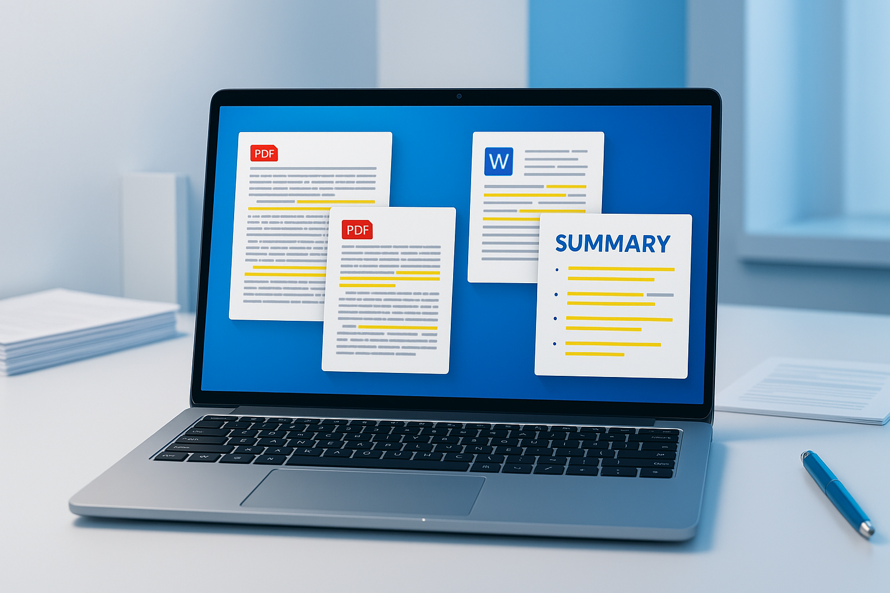

# Summarizing Documents and PDFs with Microsoft Copilot

Stop spending hours reading through lengthy reports, contracts, and research papers! Microsoft Copilot can instantly analyze and summarize documents and PDFs, giving you the key insights you need in seconds. This game-changing feature will transform how you handle information overload.



## 🎯 What You'll Learn

- Summarize Word documents with Copilot
- Extract key points from uploaded PDFs
- Generate action items from meeting documents
- Compare multiple documents quickly
- Create executive summaries from technical reports

## 📄 Method 1: Summarizing in Microsoft Word

**Perfect for:** Word documents, reports, and drafts you're actively working on

### Step-by-Step Process

1. **Open your document** in Microsoft Word
2. **Click the Copilot icon** in the ribbon (Home tab)
3. **Use one of these prompts:**
   - "Summarize this document in 3 key points"
   - "What are the main takeaways from this report?"
   - "Create an executive summary of this document"
   - "List the action items mentioned in this document"

### Example Prompts That Work Great

```
"Summarize this quarterly report and highlight any concerning trends"

"Extract the key decisions made in this meeting document"

"What are the top 5 recommendations from this proposal?"

"Create a bullet-point summary for stakeholders who have 2 minutes to read"
```

**Pro Tip:** Copilot can also summarize specific sections. Just highlight the text you want summarized before clicking Copilot.

## 📎 Method 2: Upload and Summarize PDFs in Copilot Chat

**Perfect for:** External PDFs, research papers, contracts, and documents from other sources

### How to Upload and Analyze

1. **Open Microsoft Copilot** (copilot.microsoft.com or the Copilot app)
2. **Click the attachment icon** (📎) in the chat box
3. **Upload your PDF** (up to 10MB typically)
4. **Ask Copilot to analyze it:**

### Powerful PDF Analysis Prompts

```
"What are the main points of this contract?"

"Summarize this research paper and explain the key findings"

"What risks are mentioned in this document?"

"Create a checklist based on the requirements in this PDF"

"Compare the recommendations in this report to industry best practices"
```

### Advanced PDF Analysis

```
"What questions should I ask about this proposal before approving it?"

"Identify any missing information or gaps in this document"

"What would be the next steps based on this report's findings?"

"Extract all the dates and deadlines mentioned in this document"
```

## 🤝 Method 3: Summarizing in Microsoft Teams

**Perfect for:** Meeting recordings, shared documents, and collaborative content

### During or After Meetings

1. **In a Teams meeting** with recording enabled
2. **Use Copilot in the meeting chat:**
   - "Summarize what we've discussed so far"
   - "What decisions have we made in this meeting?"
   - "List the action items assigned to each person"

### For Shared Files in Teams

1. **Open a document shared in Teams**
2. **Click Copilot in the document**
3. **Ask for team-focused summaries:**
   - "Summarize this for our team meeting"
   - "What should our team focus on from this document?"

## 📊 Method 4: Multi-Document Analysis

**Perfect for:** Comparing reports, analyzing trends across documents

### In Copilot Chat

1. **Upload multiple related documents**
2. **Ask comparative questions:**

```
"Compare the findings in these three quarterly reports"

"What common themes appear across these customer feedback documents?"

"Summarize the key differences between these two proposals"

"What trends do you see across these monthly reports?"
```

## 🎯 Pro Tips for Better Summaries

### 1. **Be Specific About Your Needs**
Instead of "Summarize this," try:
- "Summarize this for a 5-minute presentation"
- "Extract the financial implications from this document"
- "What would concern a project manager in this report?"

### 2. **Ask Follow-Up Questions**
After the initial summary:
- "What questions should I ask the author?"
- "What information is missing?"
- "How does this compare to industry standards?"

### 3. **Request Different Formats**
- "Create a bullet-point summary"
- "Write this as an email to my team"
- "Make this into a table with key points and actions"

### 4. **Focus on Your Role**
- "Summarize this from a marketing perspective"
- "What would a CFO care about in this document?"
- "Highlight the technical requirements for developers"

## 🔧 Common Use Cases

### For Managers
- **Meeting minutes** → Action items and decisions
- **Project reports** → Status updates and risks
- **Vendor proposals** → Key features and pricing comparison

### For Researchers
- **Academic papers** → Key findings and methodology
- **Industry reports** → Trends and insights
- **Survey results** → Main conclusions and recommendations

### For Legal/Compliance
- **Contracts** → Key terms and obligations
- **Policy documents** → Requirements and procedures
- **Regulatory updates** → Changes and compliance actions

## ⚡ Quick Start Checklist

- [ ] Ensure you have Microsoft 365 Copilot license
- [ ] Test with a sample document in Word
- [ ] Try uploading a PDF to Copilot Chat
- [ ] Practice with different prompt styles
- [ ] Save your favorite prompts for reuse

## 🚨 Important Notes

**Document Size Limits:**
- Word documents: No specific limit (processed in chunks if very large)
- PDF uploads: Typically 10MB maximum
- Multiple files: Can upload several, but total size matters

**Privacy & Security:**
- Documents processed by Copilot follow your organization's data policies
- Sensitive documents should only be processed in compliant environments
- Check with your IT team about data handling policies

## 🎉 Real-World Example

**Scenario:** You receive a 50-page market research report and need to brief your team in 30 minutes.

**Your Action:**
1. Upload the PDF to Copilot Chat
2. Prompt: "Create a 5-minute presentation summary of this market research, focusing on opportunities for our tech startup"

**Copilot's Response:** A structured summary with:
- Market size and growth trends
- Key opportunities identified
- Competitive landscape highlights
- Recommended next steps
- Questions to explore further

**Time Saved:** 45 minutes of reading reduced to 5 minutes of review!

## 🏁 Conclusion

Document summarization with Copilot isn't just about saving time—it's about gaining insights you might have missed and making better decisions faster. Start with shorter documents to get comfortable with the feature, then tackle those lengthy reports that have been sitting in your inbox.

The key is asking the right questions. Don't just ask for a summary—ask for what you need to know to take action.

---

*Ready to tackle that document pile? Start with Copilot and watch your productivity soar! 🚀*
