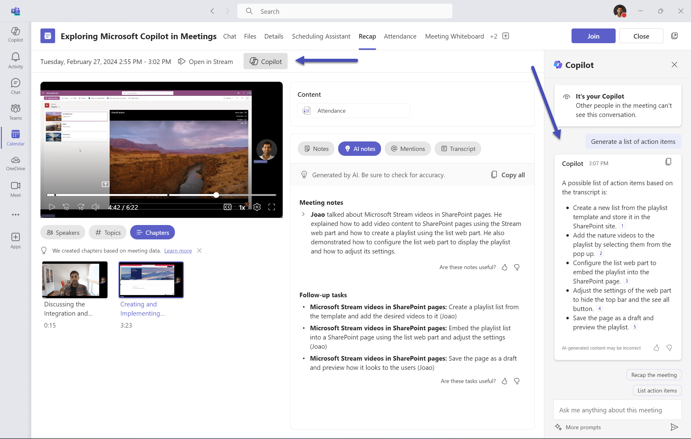

# Turn Teams Meetings Into Action Items: AI-Powered Collaboration That Actually Works

Microsoft Teams meetings can generate hours of discussion, countless decisions, and multiple action items. Instead of spending valuable time manually reviewing recordings and transcripts, let Microsoft Copilot transform your meeting content into actionable insights. This guide shows you how to leverage Copilot in Teams to boost collaboration and streamline meeting management.

*Note: Screenshots showing Copilot in action within Teams will be added to illustrate these examples.*

## Getting Started with Copilot in Teams

Before diving into advanced prompts, ensure:
- Microsoft Copilot is enabled for your organization
- You have the appropriate license (Microsoft 365 Copilot)
- Meetings are recorded with transcription enabled
- You're familiar with accessing Copilot in Teams chat and meetings

## 1. Intelligent Meeting Summaries

Gone are the days of manually reviewing hour-long meeting recordings. Use these prompts to get comprehensive yet concise meeting summaries.

### Prompt: Comprehensive Meeting Summary
```
Analyze this meeting transcript and provide a comprehensive summary including:
1. Main topics discussed (in order)
2. Key decisions made
3. Action items with owners and deadlines
4. Unresolved issues or topics that need follow-up
5. Important quotes or insights shared

Please organize this in a clear, scannable format suitable for sharing with stakeholders who missed the meeting.
```


### Prompt: Executive Summary for Leadership
```
Create an executive summary of this meeting for senior leadership, focusing on:
- Strategic decisions and their business impact
- Budget implications discussed
- Resource allocation decisions
- Risk factors identified
- Next steps requiring leadership approval

Keep it to 3-4 bullet points maximum.
```

## 2. Action Item Generation and Tracking

Transform vague meeting discussions into clear, actionable tasks that drive results.

### Prompt: Detailed Action Items with Context
```
Extract all action items from this meeting and format them as follows for each item:
- **Task**: [Clear, specific description]
- **Owner**: [Person responsible]
- **Deadline**: [Due date mentioned or "TBD" if not specified]
- **Context**: [Why this task is important - 1 sentence]
- **Dependencies**: [What needs to happen first]
- **Success Criteria**: [How we'll know it's complete]

Also identify any action items that were mentioned but lack clear ownership or deadlines.
```



### Prompt: Follow-up Email Template
```
Draft a follow-up email for this meeting that includes:
- Brief meeting recap (2-3 sentences)
- Action items table with owners and deadlines
- Key decisions for reference
- Next meeting date/agenda topics
- Professional but friendly tone suitable for our team

Format it ready to copy-paste into Outlook.
```

## 3. Meeting Preparation and Agenda Creation

Use Copilot to create more effective meetings before they even start.

### Prompt: Agenda Generation from Goals
```
We need to plan a meeting about [project/topic]. Our goals are:
- [Goal 1]
- [Goal 2]
- [Goal 3]

Create a focused 60-minute agenda that includes:
1. Time allocation for each topic
2. Discussion questions to drive productive conversation
3. Decision points we need to reach
4. Pre-meeting preparation items for attendees
5. Suggested meeting roles (timekeeper, note-taker, etc.)
```

### Prompt: Pre-meeting Brief Creation
```
Create a pre-meeting brief for attendees that includes:
- Meeting purpose and expected outcomes
- Key background information they should review
- Specific questions they should come prepared to discuss
- Materials or data they should bring
- 5-minute read time maximum

Make it actionable so people come prepared to contribute.
```

## 4. Team Collaboration Analysis

Leverage Copilot to gain insights into team dynamics and collaboration patterns.

### Prompt: Meeting Participation Analysis
```
Analyze the participation patterns in this meeting:
- Who contributed the most vs. least to discussions?
- Were there topics where certain team members dominated or stayed silent?
- What communication styles emerged (questioning, solution-focused, etc.)?
- Are there signs that someone had valuable input but didn't get airtime?
- Suggestions for improving participation balance in future meetings

Focus on constructive observations that could help us be more inclusive.
```

### Prompt: Decision-Making Pattern Review
```
Review how our team made decisions in this meeting:
- Were decisions data-driven or opinion-based?
- Did we reach consensus or was there unresolved disagreement?
- Which decisions might benefit from additional input or research?
- Are there patterns suggesting we need better decision-making processes?
- What decisions should we document more formally?

Provide recommendations for improving our decision-making effectiveness.
```

## 5. Cross-Meeting Insights and Trends

Use Copilot to identify patterns across multiple meetings and improve long-term team effectiveness.

### Prompt: Recurring Issues Identification
```
I'm sharing transcripts from our last 3 team meetings. Please identify:
- Issues or challenges that keep coming up repeatedly
- Action items that seem to get delayed or forgotten
- Topics that consume disproportionate meeting time
- Team members who consistently raise important points
- Workflow or process gaps that meetings reveal

Suggest 2-3 specific changes we could make to address these patterns.
```

### Prompt: Meeting Effectiveness Assessment
```
Evaluate the effectiveness of our recent meetings based on:
- Are we accomplishing stated meeting objectives?
- Time management - are we staying on agenda and schedule?
- Participation quality - is everyone contributing meaningfully?
- Follow-through - are action items getting completed?
- Meeting frequency - are we meeting too often/infrequently?

Rate each area 1-10 and provide specific improvement suggestions.
```

## 6. Automated Communication Workflows

Streamline team communication with Copilot-powered automation.

### Prompt: Weekly Team Update Generator
```
Based on this week's meeting transcripts and chat discussions, create our weekly team update including:
- Key accomplishments this week
- Current priorities and focus areas
- Blockers or challenges that need attention
- Upcoming deadlines and milestones
- Team member highlights or recognition
- Questions or support needs for leadership

Format for sharing in our team channel and with our manager.
```

### Prompt: Project Status Communication
```
Generate a project status update for stakeholders based on our recent project meetings:
- Current phase and percentage complete
- Major milestones achieved this period
- Upcoming deliverables and timelines
- Resource needs or constraints
- Risk factors and mitigation plans
- Budget/timeline status (on track, behind, ahead)

Include specific data points and metrics where mentioned in meetings.
```

## Advanced Tips for Maximum Impact

### 1. Combine Multiple Data Sources
Don't limit Copilot to just meeting transcripts. Include:
- Teams chat conversations related to the topic
- Shared documents and files discussed
- Previous meeting notes for context
- Project documentation references

### 2. Create Meeting Templates
Develop standard prompt templates for:
- Weekly team meetings
- Project status reviews
- Client calls
- Planning sessions
- Retrospectives

### 3. Use Copilot for Meeting Hygiene
Regular prompts to improve meeting culture:
```
Review our last 5 meetings and identify:
- Meetings that could have been emails
- Topics that need dedicated focus time
- Agenda items that consistently run over time
- People who need more speaking opportunities
```

## Real-World Implementation Example

**Scenario**: Your development team has weekly sprint planning meetings that often run long and lack clear outcomes.

**Before Copilot**: 
- 90-minute meetings with unclear action items
- Manual note-taking missing key details
- Follow-up tasks getting lost
- Team members unclear on priorities

**After Implementing Copilot**:
1. Use agenda generation prompts for focused 60-minute meetings
2. Real-time action item extraction during the meeting
3. Automated follow-up email generation
4. Weekly pattern analysis to improve sprint planning

**Result**: More focused meetings, clearer action items, and better team alignment.

## Getting Started Today

1. **Start Small**: Begin with basic meeting summaries for your next team meeting
2. **Build Templates**: Create 2-3 prompt templates for your most common meeting types
3. **Train Your Team**: Share effective prompts with teammates
4. **Iterate**: Refine prompts based on the quality of outputs you receive
5. **Scale Up**: Gradually expand to cross-meeting analysis and workflow automation

## Common Pitfalls to Avoid

- **Prompt Overload**: Don't try to extract everything from one prompt - break complex requests into smaller, focused asks
- **No Human Review**: Always review and edit Copilot outputs before sharing with others
- **Privacy Oversight**: Be mindful of sensitive information in meeting transcripts before using Copilot
- **Template Rigidity**: Adapt prompts to your team's specific needs rather than using generic templates

## Measuring Success

Track the impact of using Copilot for meeting management:
- **Time Savings**: Hours saved on manual meeting follow-up
- **Action Item Completion**: Percentage of tasks completed on time
- **Meeting Efficiency**: Reduced meeting duration with same outcomes
- **Team Satisfaction**: Survey team members on meeting effectiveness
- **Decision Speed**: Faster resolution of issues and decisions

Microsoft Copilot transforms Teams from just a communication platform into an intelligent collaboration hub. By implementing these prompts and techniques, you'll spend less time managing meetings and more time driving results.

Start with one or two prompts that address your biggest meeting pain points, then gradually expand your Copilot toolkit as you see the benefits in action.
