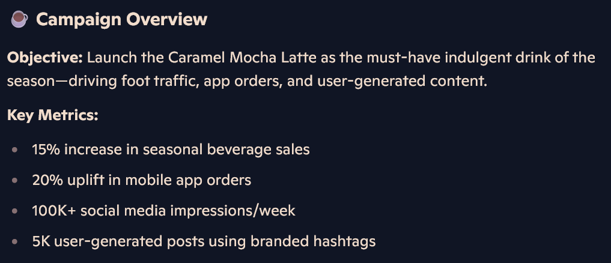

# The Ultimate Copilot Marketing Playbook: Templates, Prompts & Strategies

Whether you're a marketing professional, small business owner, or content creator, Microsoft Copilot can transform how you create marketing materials. From social media posts to email campaigns, Copilot helps you maintain consistent brand voice while generating fresh, engaging content that resonates with your audience.

## Getting Started: Setting Your Brand Context

Before diving into content creation, establish your brand context with Copilot. This ensures all generated content aligns with your brand voice and messaging.

### Brand Context Prompt

```prompt
I need help creating marketing content for [YOUR COMPANY/BRAND]. Here's our brand context:

Company: [Company Name]
Industry: [Your Industry]
Target Audience: [Demographics and psychographics]
Brand Voice: [Professional, casual, friendly, authoritative, etc.]
Key Products/Services: [Main offerings]
Unique Value Proposition: [What sets you apart]
Tone Guidelines: [Any specific tone requirements]

Please acknowledge this context and use it for all marketing content requests.
```


## Social Media Content Creation

### 1. Multi-Platform Social Media Posts

Create content optimized for different social media platforms with a single prompt:

```prompt
Create social media posts for our [PRODUCT/SERVICE LAUNCH] across these platforms:
- LinkedIn (professional, 150 words max)
- Twitter/X (engaging, under 280 characters)
- Instagram (visual-focused with hashtags)
- Facebook (conversational, community-focused)

Include relevant hashtags for each platform and suggest posting times for maximum engagement.
```

**Example Output for a Coffee Shop:**


### 2. Content Calendar Planning

Generate a month's worth of content ideas:

```prompt
Create a 30-day social media content calendar for [YOUR BUSINESS TYPE]. Include:
- Mix of promotional (30%), educational (40%), and engagement (30%) posts
- Weekly themes (e.g., Monday Motivation, Wednesday Tips, Friday Features)
- Seasonal/trending topics for [CURRENT MONTH]
- Suggested post types (images, videos, polls, stories)
- Optimal posting times for our target audience
```


## Email Marketing Campaigns

### 3. Welcome Email Series

Create an engaging onboarding sequence for new subscribers:

```prompt
Write a 5-email welcome series for new subscribers to our [BUSINESS TYPE]. Each email should:
- Email 1: Welcome and set expectations
- Email 2: Share our story and values
- Email 3: Highlight key products/services
- Email 4: Provide valuable tips/resources
- Email 5: Encourage community engagement

Include compelling subject lines and clear calls-to-action for each email.
```

### 4. Promotional Campaign Copy

Generate persuasive promotional content:

```prompt
Create email copy for a [TYPE OF PROMOTION] campaign. Include:
- Attention-grabbing subject line (A/B test variations)
- Compelling opening that creates urgency
- Clear benefit statements
- Social proof or testimonials
- Strong call-to-action
- Mobile-friendly formatting

Target audience: [YOUR AUDIENCE]
Promotion details: [SPECIFIC OFFER]
```

## Blog Content and SEO

### 5. Blog Post Ideas and Outlines

Generate content that drives traffic and engagement:

```prompt
Generate 10 blog post ideas for [YOUR INDUSTRY] that would appeal to [TARGET AUDIENCE]. For each idea, provide:
- SEO-optimized title
- Brief outline with 3-4 main points
- Target keywords
- Potential internal/external linking opportunities
- Estimated reading time
- Call-to-action suggestions
```


### 6. Product Descriptions That Convert

Create compelling product descriptions:

```prompt
Write a product description for [PRODUCT NAME] that:
- Highlights key features and benefits
- Addresses common customer pain points
- Includes emotional triggers
- Optimizes for search engines
- Ends with a compelling call-to-action

Product details: [SPECIFICATIONS AND FEATURES]
Target customer: [CUSTOMER PROFILE]
```

## Campaign Strategy Development

### 7. Complete Campaign Planning

Develop comprehensive marketing campaigns:

```prompt
Create a complete marketing campaign strategy for [CAMPAIGN GOAL]. Include:

Campaign Overview:
- Objective and key metrics
- Target audience segments
- Budget allocation suggestions
- Timeline (4-6 weeks)

Content Strategy:
- Key messaging pillars
- Content types for each channel
- Visual content suggestions
- Hashtag strategy

Distribution Plan:
- Channel mix and rationale
- Posting schedule
- Paid promotion recommendations
- Influencer collaboration ideas

Measurement Plan:
- KPIs to track
- Analytics setup
- A/B testing opportunities
```



## Advanced Marketing Techniques

### 8. Customer Persona Content

Create targeted content for specific customer segments:

```prompt
I have three customer personas for [YOUR BUSINESS]:
1. [Persona 1 description]
2. [Persona 2 description]
3. [Persona 3 description]

Create tailored marketing messages for each persona, including:
- Pain points and motivations
- Preferred communication style
- Content topics that resonate
- Platform preferences
- Buying journey considerations
```

### 9. Competitive Analysis and Positioning

Develop unique positioning in your market:

```prompt
Help me analyze our competitive position and create differentiated messaging:

Our Company: [BRIEF DESCRIPTION]
Main Competitors: [LIST 3-5 COMPETITORS]
Our Strengths: [KEY ADVANTAGES]
Market Challenges: [INDUSTRY PAIN POINTS]

Provide:
- Competitive positioning statement
- Unique value propositions
- Messaging that highlights our differences
- Content angles competitors aren't using
```

## Measuring and Optimizing Content

### 10. Performance Analysis and Optimization

Improve your marketing effectiveness:

```prompt
Analyze this marketing content performance data and provide optimization recommendations:

Content Type: [EMAIL/SOCIAL/BLOG POST]
Performance Metrics: [SPECIFIC NUMBERS]
Audience Feedback: [COMMENTS/RESPONSES]
Goals: [ORIGINAL OBJECTIVES]

Suggest:
- Content improvements
- Timing optimizations
- Audience targeting adjustments
- A/B testing opportunities
- Future content directions
```

## Pro Tips for Marketing Success

### Best Practices

1. **Batch Content Creation**: Use Copilot to create multiple pieces of content in one session for consistency
2. **Version Testing**: Generate multiple versions of the same content for A/B testing
3. **Seasonal Planning**: Create content themes aligned with holidays, events, and industry cycles
4. **Cross-Platform Adaptation**: Start with one piece of content and adapt it for different channels
5. **Data-Driven Iteration**: Use performance data to refine your Copilot prompts

### Content Quality Checklist

Before publishing any Copilot-generated content:

- [ ] Aligns with brand voice and values
- [ ] Includes clear call-to-action
- [ ] Optimized for target platform
- [ ] Spell-checked and grammar-checked
- [ ] Includes relevant keywords/hashtags
- [ ] Provides value to your audience
- [ ] Complies with platform guidelines

## Integration with Microsoft 365

### Using Copilot Across the Suite

**Word**: Create detailed marketing plans, press releases, and long-form content
**PowerPoint**: Generate presentation slides for marketing pitches and strategy reviews
**Excel**: Track campaign performance, analyze ROI, and manage content calendars
**Outlook**: Draft follow-up emails, schedule content, and manage influencer outreach

## Common Challenges and Solutions

### Writer's Block

**Problem**: Struggling with fresh content ideas
**Solution**: Use Copilot's brainstorming prompts and trending topic suggestions

### Consistency Issues

**Problem**: Maintaining brand voice across content
**Solution**: Create detailed brand guidelines and reference them in every prompt

### Time Constraints

**Problem**: Not enough time for content creation
**Solution**: Batch create content using Copilot templates and scheduling tools

### Engagement Drops

**Problem**: Declining audience engagement
**Solution**: Use Copilot to analyze successful past content and generate similar variations

## What's Next?

Ready to take your marketing to the next level? Try these advanced techniques:

- **Marketing Automation**: Integrate Copilot-generated content with automation tools
- **Personalization at Scale**: Create dynamic content for different audience segments
- **Cross-Channel Campaigns**: Develop cohesive messaging across all marketing channels
- **Performance Optimization**: Use AI insights to continuously improve content effectiveness

---

## Key Takeaways

Microsoft Copilot transforms marketing content creation from a time-consuming task into an efficient, creative process. By establishing clear brand context, using specific prompts, and following best practices, you can:

- Generate months of content in hours
- Maintain consistent brand voice across all channels
- Create data-driven, audience-focused messaging
- Scale your marketing efforts without sacrificing quality

Start with one content type, master the prompts, then expand to other marketing channels. Your audience will notice the difference, and your marketing ROI will thank you.

*Remember: While Copilot is a powerful tool, always review and customize generated content to ensure it truly represents your brand and resonates with your specific audience.*
