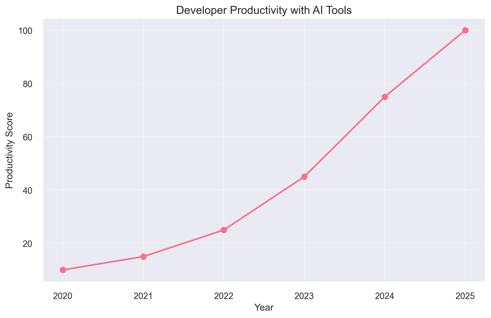
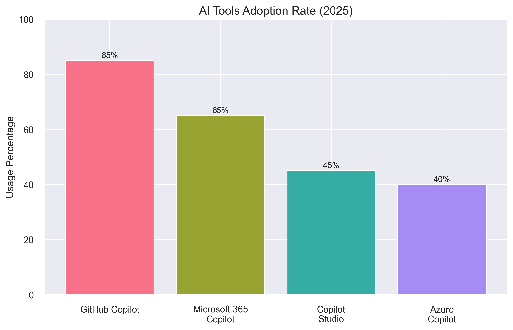
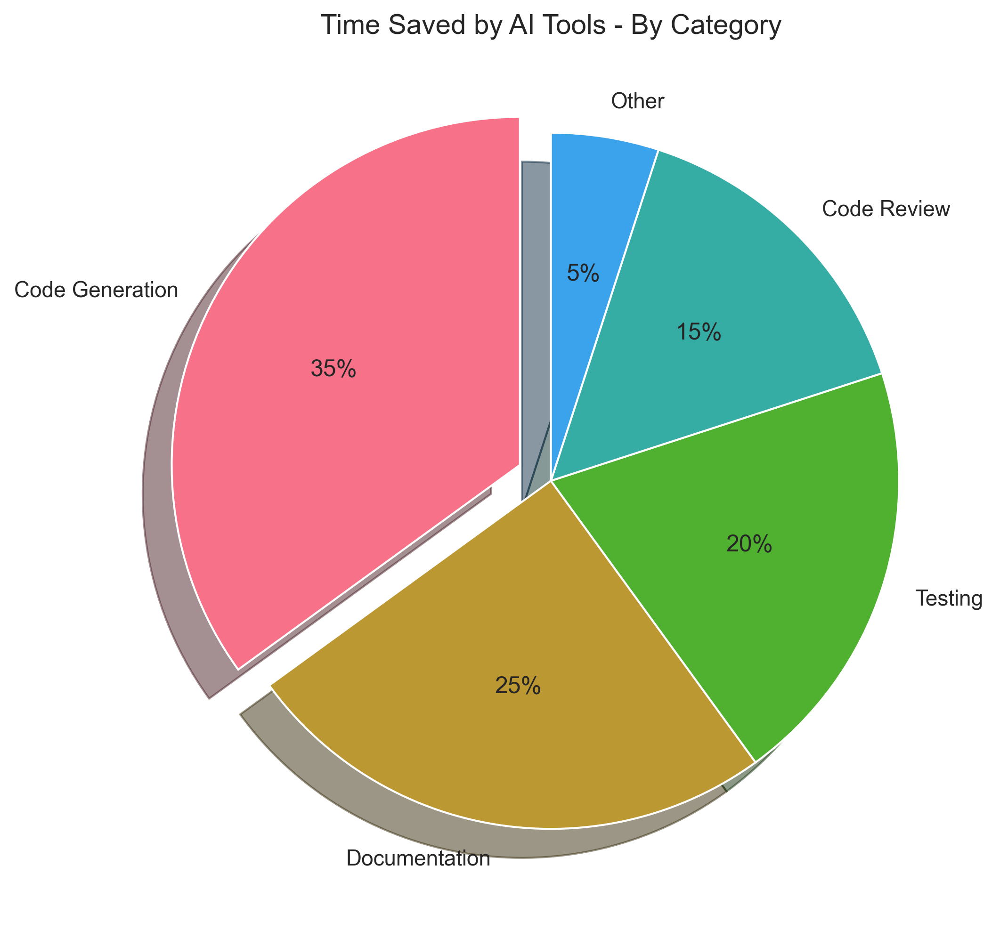

# Using GitHub Copilot to Visualize Data

GitHub Copilot is a powerful ally when working with data visualization. Let's explore how it can help you create stunning visualizations with minimal effort, using real-world examples from AI development trends.

## AI Productivity Trends

First, let's look at how developer productivity has increased with AI tools:



This visualization shows the dramatic increase in developer productivity scores from 2020 to 2025, highlighting the impact of AI-powered development tools.

## AI Tools Adoption

Next, let's examine the adoption rates of various AI tools in the development community:



The chart clearly shows GitHub Copilot leading the adoption rates among AI development tools, with significant uptake of other Copilot variants as well.

## Time Savings Analysis

Finally, let's break down where developers are saving time with AI tools:



The pie chart reveals that code generation represents the largest time savings, followed by documentation and testing tasks.

## Python Example: Creating These Visualizations

Here's a simple example of creating a bar chart with Python using Copilot:

Here's how we created these visualizations using Python with Copilot. Notice how Copilot helps structure the code and suggests appropriate styling:

```python
import matplotlib.pyplot as plt
import seaborn as sns
import numpy as np

# Set style with Copilot's suggestion
plt.style.use('seaborn-v0_8')
sns.set_theme()
sns.set_palette("husl")

# Create a line plot for productivity trend
def create_productivity_chart():
    plt.figure(figsize=(10, 6))
    years = np.array([2020, 2021, 2022, 2023, 2024, 2025])
    scores = np.array([10, 15, 25, 45, 75, 100])
    
    plt.plot(years, scores, marker='o', linewidth=2, markersize=8)
    plt.title("Developer Productivity with AI Tools")
    plt.xlabel("Year")
    plt.ylabel("Productivity Score")
    plt.grid(True, alpha=0.3)
```

Copilot will help you with the correct syntax and best practices for data visualization. It can even suggest appropriate chart types based on your data structure!

## Interactive Web Visualizations

For web applications, Copilot can help you create interactive visualizations using Chart.js. Here's how you can create an interactive version of our AI tools adoption chart:

```javascript
const ctx = document.getElementById('aiToolsChart').getContext('2d');
new Chart(ctx, {
    type: 'bar',
    data: {
        labels: ['GitHub Copilot', 'Microsoft 365 Copilot', 'Copilot Studio', 'Azure Copilot'],
        datasets: [{
            label: 'Adoption Rate (%)',
            data: [85, 65, 45, 40],
            backgroundColor: [
                'rgba(255, 99, 132, 0.8)',
                'rgba(54, 162, 235, 0.8)',
                'rgba(255, 206, 86, 0.8)',
                'rgba(75, 192, 192, 0.8)'
            ],
            borderWidth: 1
        }]
    },
    options: {
        responsive: true,
        plugins: {
            title: {
                display: true,
                text: 'AI Tools Adoption Rate (2025)'
            }
        },
        scales: {
            y: {
                beginAtZero: true,
                max: 100
            }
        }
    }
});
```

## Pro Tips for Data Visualization with Copilot

1. **Start with Comments**: Begin by commenting what you want to achieve. Copilot understands natural language descriptions like:
   ```python
   # Create a pie chart showing the distribution of time saved by AI tools
   # Include percentages and make the most important category pop out
   ```

2. **Iterate Quickly**: Use Copilot to try different visualization types and customize them.
3. **Use Modern Libraries**: Copilot excels at suggesting modern visualization libraries and their best practices.
4. **Responsive Design**: Let Copilot help you make your visualizations responsive and mobile-friendly.

Remember, Copilot can help with:

- Choosing appropriate chart types based on your data
- Setting up data structures and preprocessing
- Styling and customization options
- Handling interactivity and animations
- Implementing responsive designs and accessibility features

Try these examples and let Copilot help you create beautiful, insightful visualizations that tell your data's story effectively!
