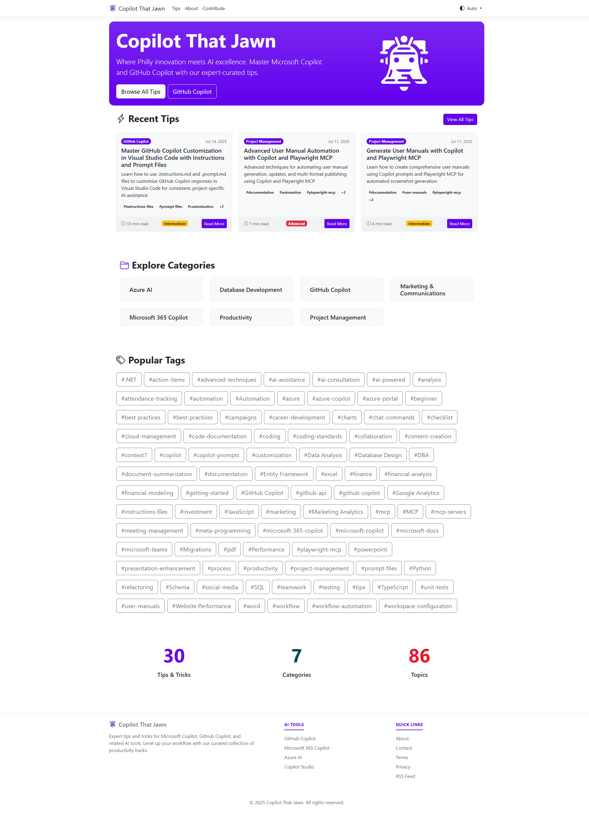

# Homepage and Navigation Guide

## Overview

Copilot That Jawn is your go-to resource for mastering AI-powered development tools, with a special focus on the Microsoft Copilot ecosystem. This guide will help you navigate the homepage and understand the main features of the website.

## Website Header and Navigation

### Main Navigation Menu

The website features a clean, responsive navigation bar at the top with the following sections:

- **Tips** - Browse the comprehensive collection of AI tips and tricks
- **About** - Learn about the website's mission and Philadelphia origins
- **Contribute** - Information on how to contribute to the community

### Theme Toggle

In the top-right corner, you'll find a theme toggle button that allows you to switch between light and dark modes for optimal reading comfort.

## Homepage Sections

### Hero Section

The homepage welcomes you with:
- **Site Title**: "Copilot That Jawn" - embracing Philadelphia's local flavor
- **Tagline**: "Where Philly innovation meets AI excellence"
- **Description**: Brief overview of mastering Microsoft Copilot and GitHub Copilot with expert-curated tips
- **Quick Action Buttons**:
  - **Browse All Tips**: Direct access to the complete tips collection
  - **GitHub Copilot**: Quick filter to GitHub Copilot-specific content

### Recent Tips Section

This section showcases the latest additions to the tip collection:
- **Featured tip cards** showing:
  - Category badge (e.g., "GitHub Copilot", "Project Management")
  - Publication date
  - Estimated reading time
  - Difficulty level indicator
  - Brief description
  - Tag preview with expandable "+X" indicator
- **"View All Tips"** link for complete browsing experience

### Explore Categories

Quick access to browse tips by major categories:
- Azure AI
- Database Development  
- GitHub Copilot
- Marketing & Communications
- Microsoft 365 Copilot
- Productivity
- Project Management

Each category is clickable and will filter the tips to show only content from that category.

### Popular Tags

A comprehensive tag cloud showing the most frequently used tags across all tips, including:
- Programming languages (.NET, JavaScript, Python, TypeScript)
- AI tools and services (azure, copilot, mcp)
- Development practices (automation, best-practices, testing)
- Specific technologies (excel, powerpoint, word)

### Site Statistics

At the bottom of the main content, you'll find current site metrics:
- Total number of tips
- Number of categories covered
- Number of topics available

## Footer

The footer provides additional navigation and external links:

### AI Tools Section
Quick links to official tool documentation:
- GitHub Copilot
- Microsoft 365 Copilot
- Azure AI
- Copilot Studio

### Quick Links
- About page
- Contact information
- Terms of service
- Privacy policy
- RSS feed for staying updated

## Key Features

### Responsive Design
The website is fully responsive and works seamlessly across:
- Desktop computers
- Tablets
- Mobile devices

### Fast Loading
Optimized for quick loading times with:
- Efficient image loading
- Streamlined CSS and JavaScript
- Fast server response times

### Accessibility
Built with accessibility in mind:
- Proper heading structure
- Alt text for images
- Keyboard navigation support
- Screen reader compatibility

## Getting Started Tips

1. **Start with Browse All Tips** - Get an overview of all available content
2. **Use Category Filters** - Focus on your areas of interest
3. **Check Recent Tips** - Stay up-to-date with the latest additions
4. **Bookmark Favorites** - Save useful tips for quick reference
5. **Enable Dark Mode** - Use the theme toggle for comfortable reading

## Next Steps

- Read the [Tips Section Guide](tips-section.md) to learn how to effectively browse and search tips
- Check out the [Search and Filtering Guide](search-filtering.md) for advanced discovery techniques
- Review the [Getting Started Guide](getting-started.md) for a comprehensive introduction
