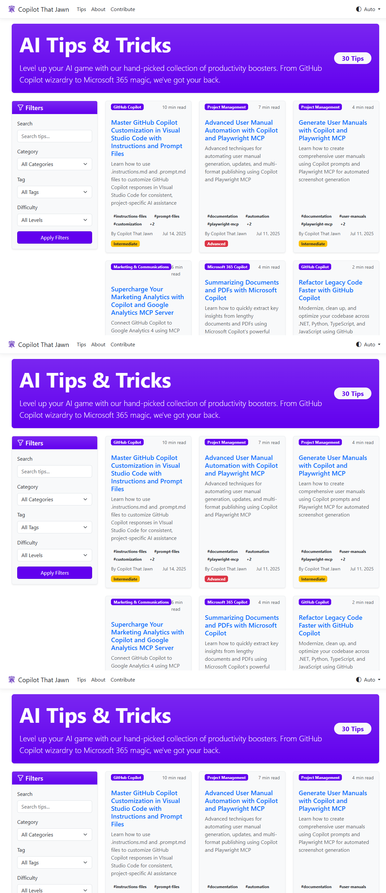
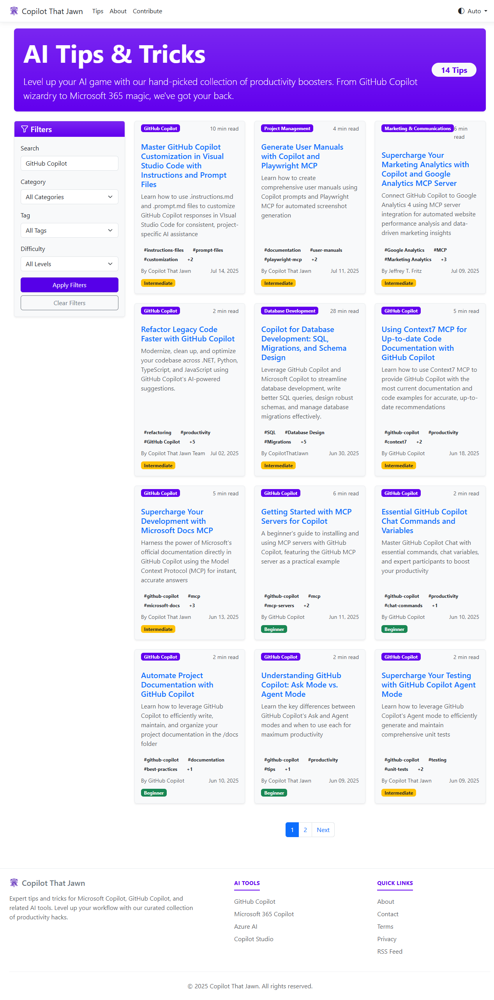
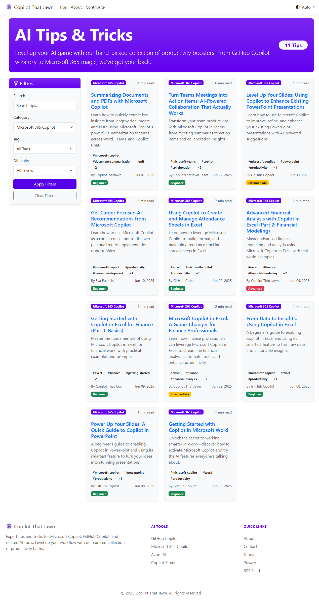

# User Documentation Index

Welcome to the Copilot That Jawn user documentation! This comprehensive guide will help you master the website and get the most out of its AI productivity content.

## Quick Navigation

### 🚀 Getting Started
- **[Complete Getting Started Guide](guides/getting-started.md)** - Your comprehensive introduction to the platform
- **[Homepage Navigation](guides/homepage-navigation.md)** - Understanding the main interface
- **[Tips Section Overview](guides/tips-section.md)** - Master the heart of the website

### 🔍 Content Discovery
- **[Search and Filtering](guides/search-filtering.md)** - Advanced techniques for finding relevant content
- **[About the Website](features/about-website.md)** - Platform mission, community, and open-source philosophy

### 📱 Visual Guides
- **[Screenshots Collection](screenshots/)** - Visual documentation captured with Playwright
- **[Interface Examples](#screenshot-reference)** - Quick visual reference for key features

## Documentation Organization

### User Guides (`/guides/`)
Step-by-step instructions and comprehensive workflows:

| Guide | Focus | Audience |
|-------|-------|----------|
| [Getting Started](guides/getting-started.md) | Complete onboarding | New users |
| [Homepage Navigation](guides/homepage-navigation.md) | Interface overview | All users |
| [Tips Section](guides/tips-section.md) | Content browsing | Regular users |
| [Search and Filtering](guides/search-filtering.md) | Content discovery | Power users |

### Feature Documentation (`/features/`)
Detailed explanations of specific capabilities:

| Document | Description | Key Topics |
|----------|-------------|------------|
| [About Website](features/about-website.md) | Platform overview | Mission, community, open source |

### Visual Documentation (`/screenshots/`)
Playwright-captured screenshots showing the website in action:

| Screenshot | Purpose | Shows |
|------------|---------|-------|
| `homepage.png` | Main interface | Navigation, recent tips, categories |
| `tips-page.png` | Tips browsing | Filters, tip cards, pagination |
| `tips-search-results.png` | Search functionality | Search results, relevance ranking |
| `category-filtered-results.png` | Category filtering | Filtered content display |
| `tip-detail-page.png` | Individual tips | Full content, metadata, sharing |
| `about-page.png` | About section | Mission statement, community info |

## Screenshot Reference

### Homepage Interface

**Key Elements Shown:**
- Main navigation (Tips, About, Contribute)
- Theme toggle for light/dark mode
- Recent tips showcase
- Category exploration grid
- Popular tags cloud
- Site statistics and footer

### Tips Browsing Experience

**Key Elements Shown:**
- Advanced filter sidebar (search, category, tags, difficulty)
- Tip card layout with metadata
- Reading time and difficulty indicators
- Pagination controls
- Clear filter functionality

### Search Results

**Key Elements Shown:**
- Active search query display
- Filtered tip results
- Relevance-based ranking
- Category and tag highlighting
- Result count and navigation

### Category Filtering

**Key Elements Shown:**
- Selected category filter (Microsoft 365 Copilot)
- Category-specific content
- Consistent tip card format
- Filter status indicators

### Individual Tip Content

**Key Elements Shown:**
- Breadcrumb navigation
- Full tip content with syntax highlighting
- Author and publication information
- Tag system and related content
- Social sharing options
- Related tips suggestions

### About Page Information

**Key Elements Shown:**
- Mission statement and purpose
- Open source community information
- Philadelphia character and branding
- GitHub repository links
- Contact information

## User Journey Maps

### New User Path
1. **Arrival** → [Homepage Navigation](guides/homepage-navigation.md)
2. **Exploration** → [Tips Section Guide](guides/tips-section.md)
3. **Discovery** → [Search and Filtering](guides/search-filtering.md)
4. **Mastery** → [Getting Started Guide](guides/getting-started.md)

### Regular User Path
1. **Quick Access** → Direct Tips browsing
2. **Targeted Search** → Advanced filtering techniques
3. **Content Consumption** → Effective tip reading strategies
4. **Knowledge Sharing** → Community participation

### Power User Path
1. **Advanced Discovery** → Complex filter combinations
2. **Workflow Integration** → Personal productivity systems
3. **Community Contribution** → Content creation and feedback
4. **Team Enablement** → Organizational adoption strategies

## Best Practices Summary

### Effective Website Usage
- **Start with Categories** - Use broad topic filters before narrowing down
- **Combine Search Methods** - Mix keywords, categories, and tags for precision
- **Follow Learning Paths** - Progress from Beginner to Advanced difficulty levels
- **Bookmark Favorites** - Save useful filter combinations and tips
- **Regular Check-ins** - Visit weekly for new content and updates

### Content Discovery Strategies
- **Keyword Variations** - Try multiple terms for the same concept
- **Tag Exploration** - Follow tag links to discover related content
- **Difficulty Progression** - Build skills systematically across levels
- **Cross-Category Learning** - Apply techniques from one area to another

### Community Engagement
- **Share Discoveries** - Help colleagues find valuable content
- **Provide Feedback** - Contribute to content quality and accuracy
- **Report Issues** - Help maintain and improve the platform
- **Contribute Content** - Share your own AI productivity discoveries

## Troubleshooting Quick Reference

### Common Issues
| Problem | Solution | Reference |
|---------|----------|-----------|
| Can't find relevant content | Try broader search terms, check spelling | [Search Guide](guides/search-filtering.md) |
| Too many results | Add category or tag filters | [Filtering Techniques](guides/search-filtering.md) |
| Website loading slowly | Clear cache, try incognito mode | [Troubleshooting](guides/getting-started.md#troubleshooting-guide) |
| Filters not working | Clear all filters and restart | [Tips Section](guides/tips-section.md) |
| Mobile interface issues | Ensure JavaScript enabled, try refresh | [Mobile Usage](guides/tips-section.md#mobile-usage) |

### Getting Help
- **Self-Service** - Search this documentation for answers
- **Community** - Check GitHub discussions and issues
- **Direct Contact** - Email info@copilotthatjawn.com for specific problems
- **Social Media** - Follow platform updates and community discussions

## Documentation Updates

This documentation is regularly updated to reflect website changes and user feedback:

- **Screenshot Refresh** - Captured using Playwright automation for accuracy
- **Content Updates** - Reflects current website features and functionality
- **User Feedback Integration** - Incorporates community suggestions and improvements
- **Accessibility Enhancements** - Ongoing improvements for all users

## Contributing to Documentation

Help improve this documentation:

- **Report Issues** - Submit GitHub issues for errors or outdated content
- **Suggest Improvements** - Propose new sections or enhanced explanations
- **Update Screenshots** - Provide current visual documentation
- **Share Use Cases** - Contribute real-world usage examples and patterns

---

**Ready to explore?** Choose your starting point:

- **New User**: Start with [Getting Started Guide](guides/getting-started.md)
- **Quick Reference**: Jump to [Tips Section Guide](guides/tips-section.md)
- **Advanced Discovery**: Master [Search and Filtering](guides/search-filtering.md)
- **Platform Overview**: Learn about [the Website](features/about-website.md)

Visit [Copilot That Jawn](https://copilotthatjawn.com) to begin your AI productivity journey!